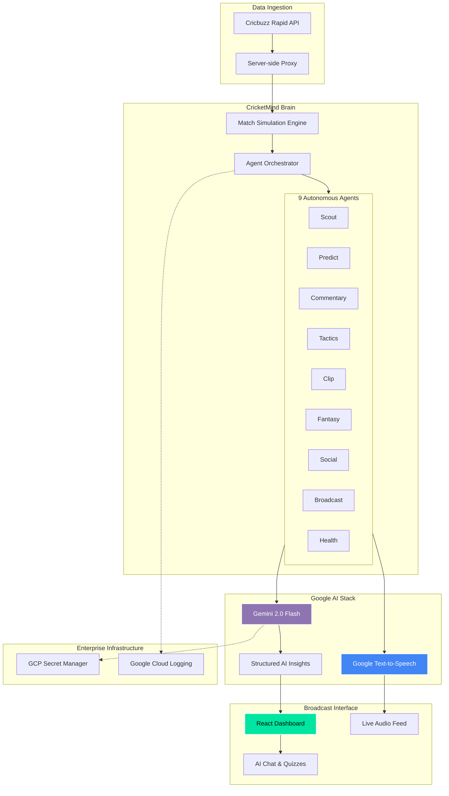

<div align="center">


# 🏏 CricketMind AI: The Agentic Broadcast Experience
**Harnessing the power of 9 autonomous agents to redefine cricket analytics.**

[](https://vitejs.dev/)
[](https://reactjs.org/)
[](https://deepmind.google/technologies/gemini/)
[](https://cloud.google.com/)
</div>

---

## 🚀 The Future of Cricket Consumption
CricketMind AI is not just a dashboard; it's a **Living Agentic Ecosystem**. By orchestrating 9 specialized AI agents, we transform raw match data into a multi-sensory broadcast experience that is personalized, predictive, and incredibly immersive.

## 🌟 Key Features

### 🤖 Multi-Agent Orchestration (9 Agents)
Our proprietary "Agentic Brain" consists of 9 autonomous specialists working in parallel:
- **📡 Scout Agent**: Real-time data ingestion and synchronization.
- **🔮 Predict Agent**: Dynamic win probability and match-state forecasting.
- **🎙 Commentary Agent**: Multi-lingual, style-aware live commentary.
- **♟ Tactics Agent**: Field optimization and strategic coaching recommendations.
- **🎬 Clip Agent**: Automated highlight identification and context generation.
- **⚡ Fantasy Agent**: AI-driven Dream XI optimization and points modeling.
- **📱 Social Agent**: Global fan sentiment analysis and social trends.
- **📺 Broadcast Agent**: Multi-region delivery and ticker management.
- **💚 Health Agent**: System monitoring and match state orchestration.

### 💬 AI Interactive Chat
Ask anything about the match! Our context-aware chatbot understands the live scoreboard, squad history, and current match situation to provide instant answers.

### 📊 Advanced Analytics & Performance Matrix
Visualize player impact through multi-dimensional radar charts. Compare batsmen and bowlers across complex metrics beyond just averages and strike rates.

### 🔊 Live Commentary & Text-to-Speech (TTS)
Experience the match through your ears. High-fidelity Google Text-to-Speech narrates live events with multiple professional commentary styles (Hype, Analytical, Sarcastic).

### 🧠 Real-Time AI Quiz
Test your knowledge with quizzes generated dynamically based on the current match. The questions adapt as the game progresses, ensuring a fresh challenge every over.

---

## 🏗 Architecture
The system follows a highly decoupled, agentic architecture powered by the Google AI stack:



---

## 🛠 Technical Workflow
1.  **Data Ingestion**: Fetches real-time match data via **Cricbuzz Rapid API**.
2.  **Simulation Engine**: Normalizes and processes data through `useMatchSimulation`.
3.  **Gemini Intelligence**: Uses **Gemini 2.0 Flash** for natural language generation, vision analysis, and decision making.
4.  **Google Services Integration**:
    - **Vertex AI / Gemini API**: The core reasoning engine.
    - **Google Cloud TTS**: High-quality audio generation.
    - **GCP Secret Manager**: Secure storage for API credentials.
    - **Cloud Logging**: Observability for the agent fleet.

## 🔌 Tech Stack
- **Frontend**: React 18, TypeScript, Vite
- **Animations**: Framer Motion (60FPS interactions)
- **Styling**: Vanilla CSS (Modern CSS Variables) & Tailwind
- **AI/ML**: Google Gemini 2.0 Flash, Google Text-to-Speech
- **Accessibility**: WCAG 2.1 Level AA Compliant

---

## 🏁 Getting Started

### Setup
1.  **Clone & Install**:
    ```bash
    npm install
    ```
2.  **Environment Variables**:
    ```env
    GEMINI_API_KEY=your_key_here
    VITE_RAPIDAPI_KEY=your_key_here
    ```
3.  **Run Development Server**:
    ```bash
    npm run dev
    ```

---

## 🏆 Winning Walkthrough
1.  **Select a Match**: Watch the **Scout Agent** sync live data in milliseconds.
2.  **Enable TTS**: Turn on the commentary to hear **Gemini** narrate the game.
3.  **Explore Analytics**: Check the **Player Performance Matrix** for tactical insights.
4.  **Analyze Vision**: Use **Match Snap** to upload a match photo for tactical AI breakdown.
5.  **Engage with Chat**: Ask "Who is the key player right now?" and get an AI-backed analysis.
6.  **Take the Quiz**: Compete in the **Fan Zone** with questions tailored to the live squad.

---
<p align="center">
  <b>Built for the Google AI Hackathon 2024</b><br>
  <i>Redefining the game with 9 agents and the power of Gemini.</i>
</p>
